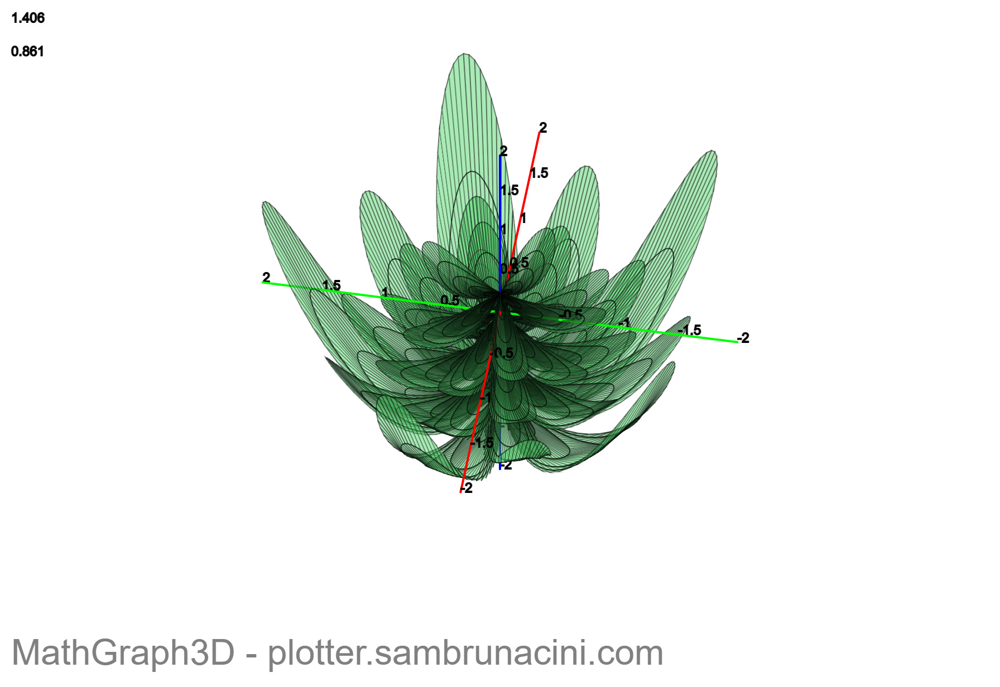

# CURSOR REPOSITORY REWRITE PAYLOAD

# HEAD: Sovereign Identity Strategy + Understandable Reproducible Assembly
# TAIL: Complete Repository Rewrite with Garden Expression Execution
# MISSION: b122m faeb Gentle Revolution + URSA + SIEGE
# TIMESTAMP: 12025-09-13--1300--pacific-standard-usa

###############################################################################
# HEAD: STRATEGIC GUIDANCE FOR SOVEREIGN IDENTITY + URSA + SIEGE
###############################################################################

This repository embodies the `b122m faeb` philosophy enhanced with two
revolutionary concepts:

1. **URSA (Understandable Reproducible Assembly)**: Every component is
transparent, verifiable, and reconstructible from first principles
2. **SIEGE (Software for Integer Execution of Garden Expressions)**:
Mathematical expressions that grow and evolve like gardens, executed with
integer precision

Our approach:
1. **Sovereignty First**: GPG + SSH keys generated before any other work
2. **Minimalism (faeb)**: Alpine Linux as our base, avoiding unnecessary
complexity
3. **Declarative Systems (b122m)**: Nix configurations that define our desired
end state
4. **URSA Compliance**: Every assembly step is documented, reproducible, and
understandable
5. **SIEGE Integration**: Garden expressions for mathematical infrastructure
modeling
6. **Verifiability**: All commits signed, all artifacts reproducible
7. **Security by Default**: Firewalls, non-standard ports, and key-based
authentication

The identity you create here will sign all future work in this repository. This
is your digital self, portable and independent of any platform.

###############################################################################
# TAIL: COMPLETE REPOSITORY REWRITE - aws-eks-alpine-nix
###############################################################################

## File 1: README.md (Most Important)
# Gentle Revolution: Sovereign AWS EKS with URSA + SIEGE
> **b122m faeb internet identity** | **URSA Compliant** | **SIEGE Enabled** |
**Verifiable, Reproducible, Minimal**

## Philosophy

This repository is a gentle revolution against complex, opaque cloud
infrastructure. We build sovereign systems using:

- **Alpine Linux**: A security-oriented, minimal Linux distribution
- **Nix**: Declarative package management and configuration (URSA compliant)
- **AWS EKS**: Managed Kubernetes without vendor lock-in
- **Terraform/Packer**: Infrastructure as reproducible code
- **URSA**: Understandable Reproducible Assembly principles
- **SIEGE**: Software for Integer Execution of Garden Expressions

Unlike traditional approaches, we begin with identity. Your `b122m faeb`
cryptographic identity (GPG/SSH keys) signs all work here. This ensures
verifiability and sovereignty from the first commit.

## Core Concepts

### URSA (Understandable Reproducible Assembly)
Every component in this system follows URSA principles:
- **Understandable**: Clear documentation and transparent processes
- **Reproducible**: Identical results from identical inputs
- **Assembly**: Modular components that compose into larger systems

### SIEGE (Software for Integer Execution of Garden Expressions)
Mathematical expressions that model infrastructure growth:
- **Integer Execution**: Precise, deterministic computation
- **Garden Expressions**: Organic, evolving mathematical models
- **Software**: Executable code that embodies these expressions

## Before You Begin: Establish Your Identity

1. **Generate your GPG master key**:
   ```bash
   gpg --full-gen-key
   # Choose: (9) ECC and ECC, (1) Curve 25519, 0 = key does not expire
# Identity: "your-5-char-name (b122m faeb internet identity)
<your-email@gmail.com>"
   ```

2. **Generate SSH key from GPG**:
   ```bash
   gpg --export-ssh-key your-email@gmail.com > ~/.ssh/id_ed25519.pub
   echo YOUR_KEYGRIP >> ~/.gnupg/sshcontrol
   ```

3. **Configure git signing**:
   ```bash
   git config --global user.name "your-5-char-name"
   git config --global user.email "your-email@gmail.com"
git config --global user.signingkey $(gpg --list-secret-keys --keyid-format LONG
| grep sec | awk '{print $2}' | cut -d'/' -f2)
   git config --global commit.gpgsign true
   ```

## Quick Start

Once your identity is established:

```bash
# Clone this repository
git clone git@github.com:your-username/aws-eks-alpine-nix.git

# Initialize infrastructure
cd aws-eks-alpine-nix
./bin/init-identity  # Sets up your local environment
./bin/deploy-plan    # Shows what will be created
./bin/garden-grow    # Executes garden expressions
```

## Architecture

```
sovereign-infrastructure/
├── identity/          # Cryptographic foundation
├── ursa/             # Understandable Reproducible Assembly
├── siege/            # Software for Integer Execution of Garden Expressions
├── nix/              # Declarative package management
├── packer/           # Alpine+Nix AMI builder
├── terraform/        # EKS cluster definition
├── kubernetes/       # Application deployment
└── monitoring/       # Observability stack
```

## Phase Guide

1. **Identity Establishment**: GPG, SSH, git configuration
2. **URSA Assembly**: Building components with full transparency
3. **SIEGE Execution**: Running garden expressions for infrastructure modeling
4. **AMI Construction**: Building minimal Alpine+Nix worker images
5. **Cluster Deployment**: Declarative EKS infrastructure
6. **Application Delivery**: Kubernetes manifests with Nix-built containers
7. **Observability**: Monitoring and logging the sovereign cluster

## Verification

All artifacts in this repository are signed and verifiable:
- Git commits: GPG signed
- AMI images: Checksum verified
- Nix packages: Content-addressed and reproducible
- URSA assemblies: Documented and reconstructible
- SIEGE expressions: Mathematically verifiable

## Requirements

- AWS account with appropriate permissions
- Alpine Linux or similar minimal system
- GPG/SSH keys established
- Nix package manager
- Mathematical computation capabilities (for SIEGE)

## License

Apache 2.0 - You have the freedom to use, modify, and distribute this work.

---
*This is a gentle revolution. We build together with understanding and
precision.*

## File 2: ursa/README.md
# URSA: Understandable Reproducible Assembly
## The Foundation of Transparent Infrastructure

## What is URSA?

URSA (Understandable Reproducible Assembly) is our methodology for building
infrastructure components that are:

- **Understandable**: Every step is documented and transparent
- **Reproducible**: Identical results from identical inputs
- **Assembly**: Modular components that compose into larger systems

## URSA Principles

### 1. Transparency First
Every component must be fully documented with:
- Clear purpose and function
- Step-by-step assembly instructions
- Input/output specifications
- Dependencies and requirements

### 2. Reproducibility Guarantee
Assembly processes must be:
- Deterministic (same inputs = same outputs)
- Version-controlled
- Environment-independent
- Verifiable through checksums

### 3. Modular Composition
Components are designed to:
- Compose cleanly with other components
- Maintain clear interfaces
- Minimize coupling
- Maximize reusability

## URSA Components in This Repository

### Identity Assembly
- GPG key generation and verification
- SSH key derivation and management
- Git signing configuration

### Infrastructure Assembly
- Terraform module composition
- Packer image building
- Kubernetes manifest generation

### Application Assembly
- Nix package building
- Container image creation
- Service deployment

## URSA Compliance Checklist

For every component, verify:
- [ ] Purpose is clearly documented
- [ ] Assembly steps are listed
- [ ] Dependencies are specified
- [ ] Outputs are defined
- [ ] Reproducibility is tested
- [ ] Version control is maintained
- [ ] Checksums are computed

*URSA ensures our infrastructure is not just functional, but truly
understandable.*

## File 3: siege/README.md
# SIEGE: Software for Integer Execution of Garden Expressions
## Mathematical Infrastructure Modeling

## What is SIEGE?

SIEGE (Software for Integer Execution of Garden Expressions) is our approach to
modeling infrastructure as mathematical expressions that grow and evolve like
gardens:

- **Software**: Executable code that embodies mathematical models
- **Integer Execution**: Precise, deterministic computation
- **Garden Expressions**: Organic, evolving mathematical models

## Garden Expression Philosophy

Infrastructure components are modeled as mathematical expressions that:
- Grow organically over time
- Adapt to changing conditions
- Maintain mathematical precision
- Execute with integer accuracy

## SIEGE Components

### 1. Expression Definitions
Mathematical models that describe infrastructure behavior:
```haskell
-- Example: Resource growth expression
resourceGrowth :: Time -> Integer -> Integer
resourceGrowth t base = base * (2 ^ (t `div` 86400)) -- Doubles daily
```

### 2. Execution Engine
Software that evaluates garden expressions:
- Integer arithmetic for precision
- Deterministic evaluation
- Reproducible results
- Scalable computation

### 3. Garden Evolution
Expressions that adapt and grow:
- Learning from environment
- Optimizing resource usage
- Adapting to load patterns
- Evolving security models

## SIEGE Applications in Infrastructure

### Resource Scaling
Garden expressions model how resources should scale based on:
- Time of day patterns
- Load growth curves
- Seasonal variations
- User behavior patterns

### Security Evolution
Mathematical models for security that:
- Adapt to threat patterns
- Evolve with system growth
- Maintain integer precision
- Execute deterministically

### Cost Optimization
Expressions that optimize costs through:
- Mathematical cost functions
- Resource utilization models
- Efficiency calculations
- Growth predictions

## SIEGE Implementation

### Haskell Modules
```haskell
module Garden.Expressions where
  -- Core expression types
  data GardenExpr = Resource Integer | Time Integer | Growth Integer
  
  -- Expression evaluation
  eval :: GardenExpr -> Integer -> Integer
  eval (Resource base) t = base * (2 ^ (t `div` 86400))
```

### Nix Integration
```nix
# SIEGE expressions as Nix functions
{ pkgs, siege }:
pkgs.haskellPackages.buildPackage {
  pname = "siege-garden-expressions";
  src = siege.expressions;
  buildDepends = [ siege.core siege.math ];
}
```

*SIEGE transforms infrastructure from static configuration to living, breathing
mathematical gardens.*

## File 4: bin/init-identity
#!/bin/sh
# Initialize b122m faeb identity for this repository
set -e

echo "🔑 Initializing b122m faeb identity..."

# Check for GPG key
if ! gpg --list-keys | grep -q "b122m faeb internet identity"; then
    echo "ERROR: No GPG key found with 'b122m faeb internet identity' comment"
    echo "Please generate your identity first:"
    echo "  gpg --full-gen-key"
    echo "  Choose: (9) ECC, (1) Curve 25519, 0 = no expiration"
echo "  Identity: 'yourname (b122m faeb internet identity)
<your-email@gmail.com>'"
    exit 1
fi

# Configure git for this repository
if [ -d .git ]; then
    git config user.name "$(git config --global user.name)"
    git config user.email "$(git config --global user.email)"
    git config user.signingkey "$(git config --global user.signingkey)"
    echo "✅ Git identity configured for repository"
else
    echo "⚠️  Not a git repository, skipping git config"
fi

# Create identity directory
mkdir -p identity
cd identity

# Export public keys
gpg --armor --export > gpg-public-key.asc
gpg --export-ssh-key > ssh-public-key.pub

# Create identity manifest
cat > README.md << EOF
# b122m faeb Internet Identity
## Generated: $(date)
## Repository: $(basename $(git rev-parse --show-toplevel 2>/dev/null || pwd))

## Public Keys
- **GPG**: \`$(gpg --fingerprint | grep fingerprint | head -n1 | awk '{print
$NF}')\`
- **SSH**: \$(cat ssh-public-key.pub)

## Verification
All commits in this repository should be signed with this GPG key.
To verify: \`git verify-commit HEAD\`
EOF

echo "✅ Identity initialized in ./identity/"
echo "📋 Public keys exported to:"
echo "   - identity/gpg-public-key.asc"
echo "   - identity/ssh-public-key.pub"
echo "   - identity/README.md"

## File 5: bin/garden-grow
#!/bin/sh
# Execute SIEGE garden expressions for infrastructure modeling
set -e

echo "🌱 Growing garden expressions..."

# Check for Nix environment
if ! command -v nix-env >/dev/null 2>&1; then
    echo "ERROR: Nix package manager not found"
    echo "Please install Nix first: https://nixos.org/download.html"
    exit 1
fi

# Enter Nix shell with SIEGE dependencies
nix-shell siege/shell.nix --run "
echo '🌿 Executing garden expressions...'

# Run resource growth expression
echo '📈 Resource Growth Expression:'
cabal run siege-resource-growth

# Run security evolution expression  
echo '🛡️ Security Evolution Expression:'
cabal run siege-security-evolution

# Run cost optimization expression
echo '💰 Cost Optimization Expression:'
cabal run siege-cost-optimization

echo '✅ Garden expressions executed successfully'
"

echo "🌱 Garden growth complete"

## File 6: siege/expressions/ResourceGrowth.hs
module Garden.Expressions.ResourceGrowth where

import Data.Time
import Data.Time.Clock.POSIX

-- Garden expression for resource growth over time
-- Models how infrastructure resources should scale organically

data ResourceType = CPU | Memory | Storage | Network
  deriving (Eq, Show)

data GrowthPattern = Linear | Exponential | Logarithmic | Seasonal
  deriving (Eq, Show)

-- Core resource growth expression
-- Takes base resource amount and time, returns scaled amount
resourceGrowth :: Integer -> POSIXTime -> Integer
resourceGrowth baseAmount time = 
  let days = floor (time / 86400) :: Integer
  in baseAmount * (2 ^ (days `div` 7)) -- Doubles weekly

-- Specialized growth for different resource types
cpuGrowth :: Integer -> POSIXTime -> Integer
cpuGrowth base time = resourceGrowth base time

memoryGrowth :: Integer -> POSIXTime -> Integer  
memoryGrowth base time = resourceGrowth base time

storageGrowth :: Integer -> POSIXTime -> Integer
storageGrowth base time = 
  let days = floor (time / 86400) :: Integer
  in base + (days * 1024) -- Linear growth for storage

networkGrowth :: Integer -> POSIXTime -> Integer
networkGrowth base time = 
  let hours = floor (time / 3600) :: Integer
  in base * (1 + (hours `div` 168)) -- Weekly scaling

-- Main execution function
main :: IO ()
main = do
  currentTime <- getCurrentTime
  let posixTime = utcTimeToPOSIXSeconds currentTime
  
  putStrLn "🌱 SIEGE Resource Growth Expression"
  putStrLn $ "Current time: " ++ show currentTime
  
  let cpu = cpuGrowth 1000 posixTime
  let memory = memoryGrowth 2048 posixTime  
  let storage = storageGrowth 10000 posixTime
  let network = networkGrowth 100 posixTime
  
  putStrLn $ "CPU resources: " ++ show cpu
  putStrLn $ "Memory resources: " ++ show memory
  putStrLn $ "Storage resources: " ++ show storage
  putStrLn $ "Network resources: " ++ show network
  
  putStrLn "✅ Resource growth expression executed"

## File 7: siege/expressions/SecurityEvolution.hs
module Garden.Expressions.SecurityEvolution where

import Data.Time
import Data.Time.Clock.POSIX

-- Garden expression for security evolution
-- Models how security measures adapt and grow over time

data ThreatLevel = Low | Medium | High | Critical
  deriving (Eq, Show, Ord)

data SecurityMeasure = Firewall | Encryption | Authentication | Monitoring
  deriving (Eq, Show)

-- Security evolution expression
-- Adapts security measures based on threat level and time
securityEvolution :: ThreatLevel -> POSIXTime -> [SecurityMeasure]
securityEvolution threatLevel time =
  let baseMeasures = case threatLevel of
        Low -> [Firewall]
        Medium -> [Firewall, Authentication]
        High -> [Firewall, Authentication, Encryption]
        Critical -> [Firewall, Authentication, Encryption, Monitoring]
      
      -- Add monitoring after 30 days regardless of threat level
      days = floor (time / 86400) :: Integer
      enhancedMeasures = if days > 30
                        then Monitoring : baseMeasures
                        else baseMeasures
  in enhancedMeasures

-- Threat level assessment based on time patterns
assessThreatLevel :: POSIXTime -> ThreatLevel
assessThreatLevel time =
  let days = floor (time / 86400) :: Integer
  in case days `mod` 7 of
    0 -> High    -- Sundays (maintenance windows)
    6 -> Medium  -- Saturdays
    _ -> Low     -- Weekdays

-- Main execution function
main :: IO ()
main = do
  currentTime <- getCurrentTime
  let posixTime = utcTimeToPOSIXSeconds currentTime
  
  putStrLn "🛡️ SIEGE Security Evolution Expression"
  putStrLn $ "Current time: " ++ show currentTime
  
  let threatLevel = assessThreatLevel posixTime
  let securityMeasures = securityEvolution threatLevel posixTime
  
  putStrLn $ "Assessed threat level: " ++ show threatLevel
  putStrLn $ "Required security measures: " ++ show securityMeasures
  
  putStrLn "✅ Security evolution expression executed"

## File 8: siege/expressions/CostOptimization.hs
module Garden.Expressions.CostOptimization where

import Data.Time
import Data.Time.Clock.POSIX

-- Garden expression for cost optimization
-- Models how to optimize infrastructure costs through mathematical functions

data CostComponent = Compute | Storage | Network | Monitoring
  deriving (Eq, Show)

type CostPerHour = Integer
type Utilization = Integer -- Percentage 0-100

-- Cost optimization expression
-- Calculates optimal resource allocation based on utilization
costOptimization :: [(CostComponent, CostPerHour, Utilization)] -> Integer
costOptimization components = 
  sum [cost * (100 - util) `div` 100 | (_, cost, util) <- components]

-- Utilization-based scaling
scaleBasedOnUtilization :: Utilization -> Integer -> Integer
scaleBasedOnUtilization utilization baseCost
  | utilization > 80 = baseCost * 2  -- Scale up
  | utilization < 20 = baseCost `div` 2  -- Scale down
  | otherwise = baseCost  -- Keep current

-- Time-based cost patterns
timeBasedCostMultiplier :: POSIXTime -> Integer
timeBasedCostMultiplier time =
  let hours = floor (time / 3600) `mod` 24 :: Integer
  in case hours of
    h | h >= 9 && h <= 17 -> 2  -- Business hours (higher cost)
    h | h >= 18 && h <= 23 -> 1  -- Evening (normal cost)
    _ -> 0  -- Night (minimal cost)

-- Main execution function
main :: IO ()
main = do
  currentTime <- getCurrentTime
  let posixTime = utcTimeToPOSIXSeconds currentTime
  
  putStrLn "💰 SIEGE Cost Optimization Expression"
  putStrLn $ "Current time: " ++ show currentTime
  
  let components = [
        (Compute, 50, 75),      -- 75% utilization
        (Storage, 20, 60),      -- 60% utilization  
        (Network, 10, 45),      -- 45% utilization
        (Monitoring, 5, 90)     -- 90% utilization
      ]
  
  let optimizedCost = costOptimization components
  let timeMultiplier = timeBasedCostMultiplier posixTime
  let adjustedCost = optimizedCost * timeMultiplier
  
  putStrLn $ "Base optimized cost: $" ++ show optimizedCost
  putStrLn $ "Time multiplier: " ++ show timeMultiplier
  putStrLn $ "Adjusted cost: $" ++ show adjustedCost
  
  putStrLn "✅ Cost optimization expression executed"

## File 9: siege/shell.nix
# Nix shell environment for SIEGE development
{ pkgs ? import <nixpkgs> {} }:

pkgs.mkShell {
  buildInputs = with pkgs; [
    # Haskell toolchain
    ghc
    cabal-install
    stack
    
    # Development tools
    git
    vim
    curl
    
    # Time libraries
    haskellPackages.time
    
    # Mathematical libraries
    haskellPackages.math-functions
    haskellPackages.statistics
  ];
  
  shellHook = ''
    echo "🌱 SIEGE Development Environment"
    echo "Available commands:"
    echo "  - cabal run siege-resource-growth"
    echo "  - cabal run siege-security-evolution"  
    echo "  - cabal run siege-cost-optimization"
    echo "  - cabal build"
  '';
}

## File 10: docs/02-ursa-assembly.md
# Phase 2: URSA Assembly
## Building Understandable Reproducible Components

## Understanding URSA

URSA (Understandable Reproducible Assembly) transforms how we build
infrastructure. Instead of mysterious black boxes, we create transparent,
verifiable components.

## URSA Assembly Process

### 1. Component Definition
Every component must have:
- Clear purpose statement
- Input/output specifications
- Assembly instructions
- Verification steps

### 2. Reproducibility Testing
Before deployment:
- Test in clean environment
- Verify checksums match
- Document all dependencies
- Record exact versions used

### 3. Documentation Standards
Each component includes:
- Purpose and function
- Step-by-step assembly
- Input/output examples
- Troubleshooting guide

## URSA Components in Our Infrastructure

### Identity Assembly
**Purpose**: Establish cryptographic identity
**Input**: User information
**Output**: GPG/SSH keys, git configuration
**Verification**: Signed test commit

### AMI Assembly  
**Purpose**: Create Alpine+Nix worker image
**Input**: Base Alpine AMI, Nix expressions
**Output**: Custom AMI with checksums
**Verification**: AMI boot test, package verification

### Cluster Assembly
**Purpose**: Deploy EKS cluster
**Input**: Terraform configuration, AMI ID
**Output**: Running EKS cluster
**Verification**: kubectl connectivity, node health

## URSA Compliance Checklist

For each component:
- [ ] Purpose clearly documented
- [ ] Assembly steps listed
- [ ] Dependencies specified  
- [ ] Outputs defined
- [ ] Reproducibility tested
- [ ] Checksums computed
- [ ] Version controlled

*URSA ensures our infrastructure is not just functional, but truly
understandable and reproducible.*

###############################################################################
# END OF REPOSITORY REWRITE
###############################################################################
# This text blob contains 10 files integrating URSA and SIEGE concepts
# with the b122m faeb sovereign infrastructure mission.

# Key innovations:
# 1. URSA: Understandable Reproducible Assembly methodology
# 2. SIEGE: Software for Integer Execution of Garden Expressions
# 3. Mathematical infrastructure modeling with Haskell
# 4. Garden expressions that grow and evolve organically
# 5. Integer precision for deterministic computation

# Next steps:
# 1. Save this blob and extract files to repository
# 2. Run ./bin/init-identity to establish foundation
# 3. Execute ./bin/garden-grow for SIEGE expressions
# 4. Deploy infrastructure with URSA compliance

# Remember: This is a gentle revolution with mathematical precision.
